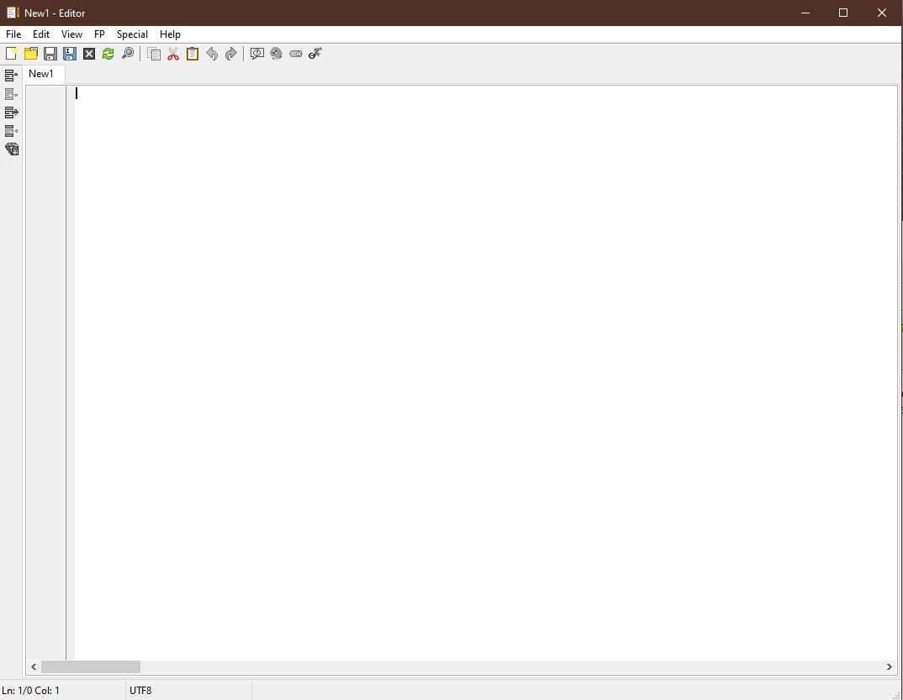
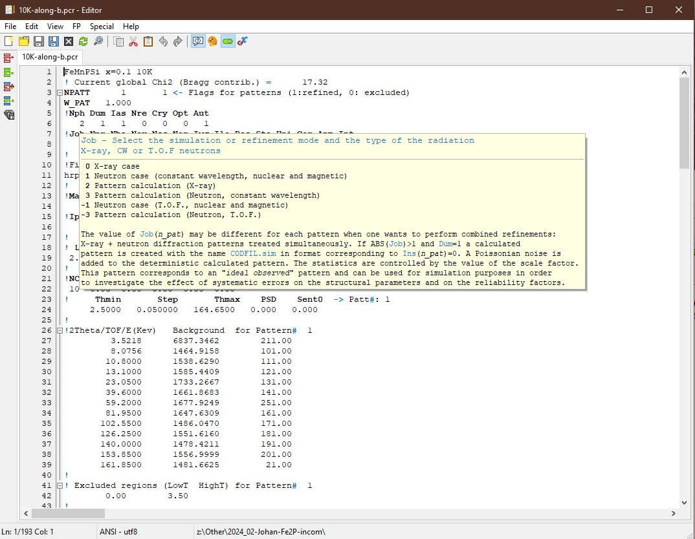

.. _Editor:

Internal editor
###############

The internal **Editor** is a simple text editor that allows you to open any file. It allows multiple files to be opened in one window. The files are open in separate tabs. It has the usual functionality of the text editor. For the PCR files, it offers additional tools and functions helpful in handling the structural refinements with **FullProf**.

It can be opened from the :ref:`Main from<Main form>` using :ref:`menu or toolbar<Menu and Toolbar>` button. It will also open any time the files are edited. If no external editor is selected in :ref:`Pref->General<General setup>` setup, then the internal one is used.

    Empty page in Editor form

The description of the basic text editor functionality, such as *Open*, *Save*, *Find*, *Undo*, etc., are skipped here. Instead, the focus is on the description of the advanced tools for the PCR files or the application itself.

General editor area
===================

- Line numbering and edits
    Lines are numbered, and if some change is made to the text, a yellow mark will be placed on the left side of the text. If the file is saved, the colour changes to green.
- Keywords
    The main keywords are printed in **bold**.
- Folding
    The content of the PCR file can be folded at several points to shorten the content on the page. See the small rectangles on the left side of the text.

Menu and Toolbar
================

Most of the **Menu** items have their corresponding **Toolbar** buttons.

Left toolbar and menu Edit
--------------------------

.. image:: ./svg/fold-all.png
    :align: left
    :width: 20px

**Fold all** - The *Fold all* will collapse all the fold points.

**Expand all** - The *Expand all* will expand all the fold points.

**Fold background** - It will fold the part of the long *background* lists when ``Nba > 2``. A shortcut ``Ctrl+B``.

**Go to Phase XY** - The drop-down menu with the list of the phases to quickly navigate to the part of the PCR file where the selected phase starts. A shortcut ``Alt+PhaseNumber``.

**Launch CrysCalc** - The button is active only when **CFL file** (created by :ref:`CC<CC>` tool at the :ref:`Supplementary files<Supplementary files>` or by user) is open. It allows quick launch of the **CrysCalc** application with the CFL file as input.

Top toolbar and menu View
--------------------------

**Show FullProf hints** - When enabled/pressed, the description of the **keywords** in the form of *hint* will appear when the cursor is over it. The font size of the hints can be adjusted in the :ref:`Pref->Colours&layout<Colours and layout>`.

    Editor with the PCR file open and active hint on the ``Job`` parameter

.. note::
    **Keywords** descriptions are taken from the *FullProf* manual (year 2000) combined with additional information from *changelog* and personal experince. If you have more insight help update, please (see **Menu Special** below).

Top toolbar and menu FP
--------------------------

**Dummy run** - When clicked, it changes the parameter ``Aut`` and sets the :literal:`!Number of refined parameters` both to **0** and start the refinement. To set those two parameters to zero means that only one cycle will be performed without real refinement of any parameter. In other words, only *simulation* will be performed. It is useful when you want to check the influence of the hand-made change of certain parameters. A shortcut ``Ctrl+F9``.

**"Aut" parameter status** - It shows the status of the parameter ``Aut``. If ``Aut=1``, the button is pressed, and if ``Aut=0``, the button is released. You can **change** the status by clicking the button. The editor will set the ``Aut`` parameter as described.

.. tip::
    To restart the full refinement after **Dummy run**, press the **"Aut" parameter status** to set ``Aut`` to **1** and start the refinement.

**𝜒2 warning remove** - When your refinement ends up with the below message, your PCR will not be overwritten with the new results. But if you are sure that this is a good way for you to continue, click on this button, and the editor will remove the line ``! Current global Chi2 ...`` from the PCR and save it. This action will remove this warning during the next refinement run.

.. warning::

    The warning is important to preserve your PCR setting when the refinement goes wrong. *FullProf* compares the lates calculated 𝜒2 with the one stored in the PCR file (``! Current global Chi2 (Bragg contrib.) = 2.608``). If you are fine with the worst 𝜒2, then you can increase the number in that line to some big number or remove it. By clicking **𝜒2 warning remove**, the application does it for you.

    .. parsed-literal::
        => Normal end, final calculations and writing...
        => W A R N I N G!
        => Current parameters not saved to the current PCR file: final(Chi2) > 1.2*initial(Chi2)
        => Current parameters are saved in a file of extension NEW

.. _Special editor menu:

Menu Special
------------

- Edit FullProf Hints
    It saves (into :ref:`config<SettingStorage>` folder) and opens the source file for the *FullProf hints*. This file contains special formatting input, which is read by the application and shown in the form of hints. You can edit the content of each hint, correct it or add a new one. Please follow the instructions in the header and look to the other hints for proper formatting. Please, **share** it when you enhance it.

    When you save the changes in the file, you can see the effect directly in the open PCR file, as the hints are reloaded immediately after saving.

.. attention::
    The application searches first in the :ref:`config<SettingStorage>` folder for this file. If it exists, it loads it. If the file doesn't exist, it loads the hints from the memory. If something goes wrong, just **remove** the hint file from the folder.

- Edit Python SXY plotter script
    It saves (into :ref:`config<SettingStorage>` folder) and opens the source file for the *SXY plotter*. You can edit/modify the content of the script. When you use the **SXY plotter** form, the application will use your modified script stored in the :ref:`config<SettingStorage>` folder instead of build-in one. If you want to restore the default, just delete your modified one.

- Edit Python MIC plotter script
    It saves (into :ref:`config<SettingStorage>` folder) and opens the source file for the *MIC plotter*. You can edit/modify the content of the script. When you use the **MIC plotter** form, the application will use your modified script stored in the :ref:`config<SettingStorage>` folder instead of build-in one. If you want to restore the default, just delete your modified one.

Help
----

* ``FullProf News`` (Ctrl(⌘)+Alt+M)
    It opens in the editor the *FullProf changelog* (information from the year 2000 onwards)

* ``FullProf Manual`` (Ctrl+Shift+M)
    It opens the *FullProf manual* (PDF file from 2000) in the default viewer.
