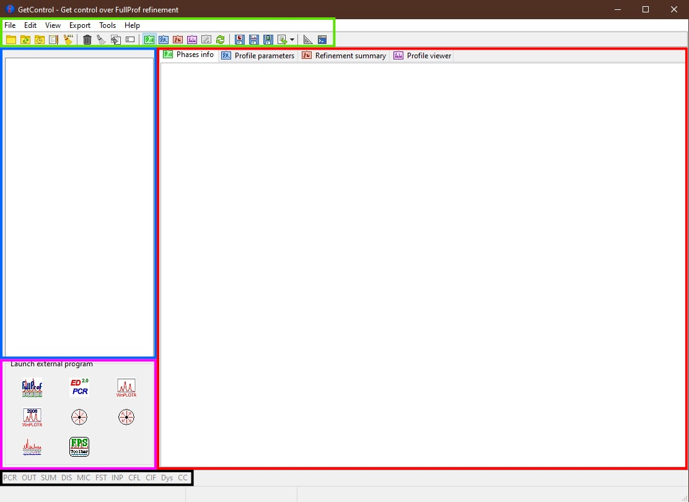

.. _Main Form:

Main form
#########

The **GetControl** main form contains several main parts: `Menu and Toolbar`_, `Files list`_ box, `Information pages`_ with various tabs, `FP applications`_ panel, and `Supplementary files`_ button bar, which are described in more detail below. The main form appears at the start of the application.

    Main GetControl window. Green - `Menu and Toolbar`_, Red - `Information pages`_, Blue - `Files list`_, Pink - `FP applications`_, Black - `Supplementary files`_

How to start
============

To start using the **GetControl**, go to the menu ``File->Open Directory``, use the ``Ctrl(⌘)+O`` or ``Drag&Drop`` any file from your working directory (it doesn't need to be a PCR file). The application will search all the PCR files in the selected directory, sort them in the `Files list`_ and automatically load the info from the first PCR file.

.. _Menu and Toolbar:

Menu and Toolbar
================

**Menu** and **Toolbar** provide quick access to the application functions, visualisations and other tools.

Most of the **Menu** items have their corresponding **Toolbar** buttons. Below is the list with a quick explanation:

- File
    .. image:: ./svg/folder-open.png
        :align: left
        :width: 20px

    * ``Open directory`` (Ctrl(⌘)+O)
        It enables you to select your working directory, where it searches for the PCR files (sub-directories are not included).

    .. image:: ./svg/reload-folder.png
        :align: left
        :width: 20px

    * ``Reload folder`` (F4)
        It again searches for the PCR files in the working directory (use when you copy/add/delete the PCR files).

    .. image:: ./svg/folder-open-recent.png
        :align: left
        :width: 20px

    * ``Recent directories``
        It shows the list of 10 previously used directories.
    * ``Save`` [1]_
        There are three sub-menus to save

        .. image:: ./svg/save-info.png
            :align: left
            :width: 20px

        + text info from *Phases info*/*Profile parameters*/*Refinement summary* tabs

        .. image:: ./svg/save-xy.png
            :align: left
            :width: 20px

        + an SXY [2]_ file of the patterns shown on *Profile viewer* tab

        .. image:: ./svg/save-picture.png
            :align: left
            :width: 20px

        + the picture of the *Profile viewer* tab

    .. image:: ./svg/bin-trash.png
        :align: left
        :width: 20px

    * ``Delete file`` (Ctrl(⌘)+D)
        It deletes the selected PCR file and all supplementary files; the form, when you can filter by extension what to delete, will pop up (see **Note** below).

    .. image:: ./svg/editor.png
        :align: left
        :width: 20px

    * ``Editor`` (Ctrl(⌘)+E)
        It opens the internal :ref:`Editor<Editor>` or external (see :ref:`Pref->General <General setup>` setup tab) editor.

    .. image:: ./svg/GetControl.png
        :align: left
        :width: 20px

    * ``New instance`` (Shift+F1) [3]_
        It opens the new instance of the **GetControl** application.

    .. image:: ./svg/exit.png
        :align: left
        :width: 20px

    * ``Exit`` (Ctrl(⌘)+Q) [3]_
        It closes the application
- Edit
    .. image:: ./svg/clean.png
        :align: left
        :width: 20px

    * ``Clear supplementary files`` (Ctrl(⌘)+Y)
        It will allow you to delete particular supplementary files (the new form where the filer can be selected will pop up; see **Note** below) for the selected PCR file (it can free the space on your disk).

    .. image:: ./svg/clean-all.png
        :align: left
        :width: 20px

    * ``Clear supplementary files for ALL``
        The same as above, but now it applies to all the PCR files in the working directory.

    .. image:: ./svg/backup-file.png
        :align: left
        :width: 20px

    * ``Backup structure`` (Ctrl(⌘)+B)
        It backups the selected PCR file together with the supplementary files by adding `-backup` (by default) to their file name; see :ref:`Pref->General <General setup>` setup tab to allow your own selection of the *suffix*/name.

    .. image:: ./svg/rename.png
        :align: left
        :width: 20px

    * ``Rename structure`` (Ctrl(⌘)+R)
        It renames the select PCR file with all supplementary files.

    .. image:: ./svg/setup.png
        :align: left
        :width: 20px

    * ``Preferences`` (Ctrl(⌘)+,)
        It opens the :ref:`Preferences<Preferences>` form.
- View
    .. image:: ./svg/phase-info.png
        :align: left
        :width: 20px

    * ``Phases info`` (Ctrl(⌘)+1)
        It shows/switches to the `Phases info`_ tab.

    .. image:: ./svg/profile-info.png
        :align: left
        :width: 20px

    * ``Profile parameters`` (Ctrl(⌘)+2)
        It shows/switches to the `Profile parameters`_ tab.

    .. image:: ./svg/summary-info.png
        :align: left
        :width: 20px

    * ``Refinement summary`` (Ctrl(⌘)+3)
        It shows/switches to the `Refinement summary`_ tab.

    .. image:: ./svg/profile-viewer.png
        :align: left
        :width: 20px

    * ``Profile viewer`` (Ctrl(⌘)+4)
        It shows/switches to the `Profile viewer`_ tab.

    .. image:: ./svg/mic-info.png
        :align: left
        :width: 20px

    * ``Microstructure viewer`` (Ctrl(⌘)+5)
        It shows/switches to the `Microstructure viewer`_ tab.

    .. image:: ./svg/reload.png
        :align: left
        :width: 20px

    * ``Reload`` (F5)
        It reloads structure information from the selected PCR file.

.. _Menu export:

- Export [4]_
    .. image:: ./svg/export-tab.png
        :align: left
        :width: 20px

    * ``"Phases info" TAB separation``
        It copies to the **clipboard** information about all the phases from the `Phases info`_ tab; atomic positions are separated by TAB.

    .. image:: ./svg/export-tex.png
        :align: left
        :width: 20px

    * ``"Phases info" in Latex``
        It exports to the **clipboard** information about all phases from the `Phases info`_ tab in the Latex table format.

    .. image:: ./svg/export-cell.png
        :align: left
        :width: 20px

    * ``Fraction and Cell for active``
        It copies to the **clipboard** the *name*, *fraction* and *cell parameters* separated by TAB for all the phases in the one currently selected PCR.

    .. image:: ./svg/export-cell-all.png
        :align: left
        :width: 20px

    * ``Fraction and Cell for selected``
        It copies to the **clipboard** the *name*, *fraction* and *cell parameters* separated by TAB for all the phases in all selected PCR; it is easy to paste to worksheet-like software for quick plotting of the cell parameter evolution.

    .. image:: ./svg/Python.png
        :align: left
        :width: 20px

    * ``Python script for SXY plotter``
        It opens the form when you can adjust the command for the Python script, which allows you to plot the pattern(s).

    .. image:: ./svg/Python.png
        :align: left
        :width: 20px

    * ``Python script for MIC plotter``
        It opens the form when you can adjust the command for the Python script, which allows you to plot the Williamson-Hall plot to visualise the microstructure.
- Tools
    .. image:: ./svg/measure.png
        :align: left
        :width: 20px

    * ``Measure distance`` (Ctrl+M)
        The tools to measure different distances on the pattern chart; an additional form opens to select the measurement along various axes and visualise the results (see `Profile viewer`_).

    .. image:: ./svg/terminal.png
        :align: left
        :width: 20px

    * ``Open Terminal`` (Ctrl+T) [3]_
        It will try to open the default system terminal.

    .. image:: ./svg/COD.png
        :align: left
        :width: 20px

    * ``Open COD`` [3]_
        It opens the web page of the *Crystallographic Open Database* (COD).
- Help
    .. image:: ./svg/check-for-update.png
        :align: left
        :width: 20px

    * ``Check for update`` (F2)
        It opens the dialogue to check the availability of the new version and the updating process.

    .. image:: ./svg/what-is-new.png
        :align: left
        :width: 20px

    * ``What is new``
        It opens the update information changelog in the editor. The same information you can find :ref:`here<WhatIsNew>`.

    .. image:: ./svg/FP-news.png
        :align: left
        :width: 20px

    * ``FullProf News`` (Ctrl(⌘)+Alt+M)
        It opens in the editor the *FullProf changelog* (information from the year 2000 onwards)

    .. image:: ./svg/FP-manual.png
        :align: left
        :width: 20px

    * ``FullProf Manual`` (Ctrl+Shift+M)
        It opens the *FullProf manual* (PDF file from 2000) in the default viewer.
    * ``Write debug log``
        It enables/disables to write the debug log in the :ref:`config <SettingStorage>` directory. By default, it is switched off.

.. [1] The *Save* buttons are located at the right part of the **Toolbar**, but they have the same icons
.. [2] **SXY** is a single-X and multi-Y file format
.. [3] It exists only in **Menu**

    .. image:: ./svg/export.png
        :align: right
        :width: 20px

.. [4] In the **Toolbar** the *Export* items are hidden under the *Export option* button ->

.. note::
    The menu on the macOS systems is located in the system menu (top bar). The :ref:`Preferences <Preferences>` and *About* dialogs are located under **GetControl** main menu item as usual for the system.

.. admonition:: Delete & Clear filter selection
    :class: attention

    .. image:: ./img/clean-delete-form.jpg
        :width: 50%
        :align: right

    The form for delete/clear filter selection allows you to select types of files to delete. When the *delete* PCR function is selected, then the list also contains the PCR file. Otherwise, only supplementary files are shown. You can select even individual files from the list.

    No IRF or data files are listed. Only be *careful* with the **hkl** filter when using the HKL file as an input.

.. tip::
    When you use the ``Backup structure`` function with the enabled **Ask for name when backup?** (see :ref:`Pref->General <General setup>` setup tab), it works like a backup and rename together.

.. _Files list:

Files list
==========

In the *Files list*, all PCR files found in the working directory are listed. You can select the file by clicking the mouse or using the keyboard arrows. By right-clicking, you will have access to the selected functions dedicated to the currently selected PCR file (``Delete file``, ``Clear supplementary files``, ``Reload``, ``Backup``, and ``Rename structure``).

You can change the order of the PCR file by the ``click&drag`` method. It is particularly useful when the searched order is not the one you like. The order should be preserved even when you do the ``Reload directory``, but it will be lost when you load the different directory and come back.

It is possible to select multiple files by holding *Ctrl(⌘)* and clicking. This is useful when you want to export ``Fraction and Cell for selected`` and then paste the parameters into the worksheet-like software for plotting.

.. tip::
    The current working directory is shown in the status bar of the main application window.

    The width of the list can be adjusted by ``drag&drop`` of the left side splitter.

.. note::
    In macOS, the multi-file selection with ⌘ pressed works properly **only** when the selection starts from the bottom of the list.

.. _Information pages:

Information pages (TABs)
========================

.. _Phases info:

Phases info tab
---------------

In the **Phases info** tab, the application collects various information about all phases. If **OUT** and **SUM** files exist, the *errors*, *phase fraction*, *density*, *R-factors*, *site multiplicity*, etc., are extracted as well and properly shown, then there is a comprehensive overview of your refinement. The unit cell composition and site fractions are also calculated.

The information for each phase is coloured based on the preselected pattern (see :ref:`Pref->General <General setup>` setup tab). If it is too long, it can be folded at the phases or atom level (click the small rectangles on the left side of the text).

.. figure:: ./img/phasesinfo.jpg
    :width: 80%
    :align: center

    Phases info tab

.. tip::
    If you want to calculate the composition in the *chemical formula format* (by default, the composition of the whole unit cell is calculated), provide the number of formula units per unit cell (**Z value** -> input like ``Z=x`` where ``x`` is the integer number) in the PCR file just after the phase title. It will not affect any other *keywords* you can use with *FullProf*.

    .. parsed-literal::

        !-------------------------------------------------------------------------------
        !  Data for PHASE number:   1  ==> Current R_Bragg for Pattern#  1:   4.7090
        !-------------------------------------------------------------------------------
        Fe2P - structural - 1 **Z=3** magph2
        !
        !Nat Dis Ang Jbt Isy Str Furth        ATZ     Nvk More
          8   0   0   0   0   0   0        423.0645   0   0

.. _Profile parameters:

Profile parameters tab
----------------------

In the **Profile parameters** tab, there are extracted some useful information about the profile for each phase as *profile type*, *IRF used*, *profile parameters* refined, etc. If the *preferred orientation* correction is used, the parameters are also listed here. If *microstructure* is calculated, a summary is provided for size and strain broadening (average strain/size parameters).

If the ``Ana`` parameter is set to **1**, then also info about the sharpest reflection and some other analytical information is extracted together with the *Effective number of reflections* (see **Attention** below).

.. figure:: ./img/profileparameters.jpg
    :width: 80%
    :align: center

    Profile parameters tab

Information is sorted by phases and colourised with the same pattern as in the `Phases info`_ tab. In a multi-pattern setting, information for each pattern is connected with each phase.

.. attention::
    The parameter *Effective number of reflection* should be greater than **4**, meaning that you have more than four independent reflections per intensity affecting parameter. Otherwise, your refinement result may not be accurate.

.. _Refinement summary:

Refinement summary tab
----------------------

**Refinement summary** tab shows the information about the whole refinement, for example, *Chi2*, number of parameters and information about the last refinement run.

If the parameter ``Mat`` is set to **1**, the list of correlated parameters is listed (only for correlation greater than 50%).

The following block contains information about the patterns (*data file*, *pattern contribution*, *zero shift*, etc.). It also, for each pattern, provides the *R-factors* and the *Scor* parameter. According to the FP manual, all the errors of the refinement should be multiplied by this *Scor* factor to obtain more realistic values. The **GetControl** can do it for you when you check out this option in the :ref:`Pref->General<General setup>` setup. If done so, you will see the text **(applied!)** after the *Scor* value.

.. figure:: ./img/refinementsummary.jpg
    :width: 80%
    :align: center

    Refinement summary tab

After all the pattern information, there is a list of potentially negative FWHM points. If your refinement is good, you should see nothing in the list.

.. _Profile viewer:

Profile viewer tab
------------------

The **Profile viewer** tab visualises the PRF file with some advanced features. In a multi-pattern setup, there is a button for each pattern on the top of the tab to switch between them quickly. The *hint* when over the button provides information on the pattern radiation and file name.

Braggs are coloured with the same pattern as phases in the `Phases info`_ tab. The same applies when the phase contribution is calculated.

.. figure:: ./img/profileviewer.jpg
    :width: 80%
    :align: center

    Profile viewer tab

The layout of the **Profile view**, for example, the axis font size, etc., can be adjusted in the :ref:`Pref->Profile chart <Profile chart>` setup tab.

.. tip::
    To get the contribution for each phase, set the ``Ipr`` parameter to **3**. Then, launch the FP refinement, and when you reload the file, the application will automatically search for the phase's contributions and load them.

If you hang over the Bragg positions, a hint pops up to show the extensive information gathered from the OUT and PRF files about the pointed position.

.. figure:: ./img/profile-braggs.jpg
    :width: 60%
    :align: center

    Bragg information

.. _Axis manipulations:

Axis manipulations
^^^^^^^^^^^^^^^^^^

At the bottom of the tab, there is a drop-down menu to adjust the X and Y axis. For the X-axis, there is an option to plot in the original (**2Theta**/**TOF**), **d** or **Q** spacing. For the Y-axis, there is an option for the **original**, **relative**, **relative with zero=Ymin** and **Square root**. Next to those options, there are informative labels showing the position of the cursor in various units.

.. tip::
    To easily compare results in the multi-pattern setup, set the X-axis in **Q** or **d** spacing and the Y-axis to **relative with zero=Ymin**. Then, you can switch between patterns and see how each pattern contributes to the same reciprocal space region. If you zoom in, the zoom region is preserved when you change the pattern.

Chart navigation
^^^^^^^^^^^^^^^^

The navigation on the chart is a bit different from the *Winplotr* navigation. Below is a description of the possible manipulations:

- **ZOOM IN**
    Use the mouse ``drag&drop`` technique from *left-to-right* and from *top-to-bottom*, in other words, in diagonal to **down-right**. This is the same as in *Winplotr*.
- **UNDO ZOOM**
    Use the mouse ``drag&drop`` technique in the opposite direction than *ZOOM IN* (kind of "unzoom"). It means diagonal to **top-left**. The single **left-click** does the same job. **Different** from *WinPlotr*.
- Chart **positioning**
    Use the mouse **right** ``click&drag`` method to move the chart freely in any direction.

.. note::
    There is no **right-click** routine for *Winplotr*. *Undo-zoom* is done by a simple click or "unzoom" drag&drop.

.. _Chart export:

Chart export
^^^^^^^^^^^^

You can export charts in several ways. You can save the **Profile viewer** screen as a *picture* of various formats. You can save the data as an *SXY file* (header describes the meaning of the columns), import it to your favourite data plotting software, and do your own tricks. Or you can use the provided Python script - **SXY plotter**. All *export* features are available in the `Menu and Toolbar`_ -> ``Export``.

.. _SXY plotter example:

.. figure:: ./img/sxy-plotter-example.jpg
    :width: 90%
    :align: center

    Example of the *SXY plotter* output

Measuring tool
^^^^^^^^^^^^^^

When the **Profile viewer** is active tab, you can use the **Measuring tool**, which allows you to measure along X, Y or general directions. The info about the measured distances is visualised on the measuring tool form, which pops up when the tool is activated.

.. figure:: ./img/profile-measuring.jpg
    :width: 70%
    :align: center

    Measuring tool example

.. note::
    The **ZOOM** options will not work when *Measuring form* is visible. You need to use the **Ctrl** to enable it within the measuring mode or close the form.

.. _Microstructure viewer:

Microstructure viewer tab
-------------------------

The **Microstructure viewer** tab is only visible when the *microstructure effects* are calculated and the *IRF* (instrument resolution file) is provided. In the default setting, it plots the *Williamson-Hall* (WH) plot. In the top part of the tab, you can select the appropriate phase or pattern. If the phase or pattern name is *grey*, it means that no microstructure has been implemented in the refinement for this phase/pattern.

If the asymmetric model of broadening is used, the chars of *Maximum strain* or *Apparent size* can reveal the directional feeling about the microstructure.

.. figure:: ./img/microstructureviewer.jpg
    :width: 80%
    :align: center

    Microstructure viewer tab

The layout of the **Microstructure view**, for example, the axis font size, etc., can be adjusted in the :ref:`Pref->MIC chart <MIC chart>` setup tab.

.. note::
    **Microstructure viewer** visualises the content of the MIC file created during refinement.

The WH plot can be plotted using the provided Python script - **MIC plotter**.

.. _FP applications:

FP applications
---------------

The panel provides access to a quick launch of the selected *FullProf* applications.

.. figure:: ./svg/FP2k.ico
    :width: 32px
    :align: left

- *FullProf* (shortcut F9)
    Launching the FullProf (*wfp2k*) with the selected PCR file.

.. figure:: ./svg/EdPcr.png
    :width: 32px
    :align: left

- *EdPcr* (shortcut F10)
    Open the selected PCR file with the *EdPcr* tool

.. figure:: ./svg/WinPLOTR.png
    :width: 32px
    :align: left

- *WinPlotr* (shortcut F11)
    Opens the PRF file with the *WinPlotr* tool. This tool is not available on *Unix-based* systems.

.. figure:: ./svg/WinPLOTR-2006.png
    :width: 32px
    :align: left

- *WinPlotr2006*
    Opens the PRF file with the *WinPlotr2006* tool.

.. figure:: ./svg/Sym.ico
    :width: 32px
    :align: left

- *Symmcal*
    It opens the *Symmcal* tool for information about the space groups

.. figure:: ./svg/SymMag.ico
    :width: 32px
    :align: left

- *MagSymmCal*
    It opens the *MagSymmCal* tool for information about the magnetic space groups

.. figure:: ./svg/PowderPat.ico
    :width: 32px
    :align: left

- *PowderPat*
    It opens the *Powder Pattern Calculation* tool. It can import CIF files and simulate the powder patterns for various settings and radiations, etc.

.. caution::
    Those tools are available only when the *FullProf* path is properly set up in the :ref:`Pref->General <General setup>` setup tab.

.. _Supplementary files:

Supplementary files
-------------------

The **Supplementary files** buttons' bar provides easy access to the various supplementary files created during the refinement. You can edit them or launch additional tools (*FPStudio*, *GFourier*, etc.) with the proper input files and perform further analysis. The buttons act as single buttons or as a drop-down menu that appears when clicking to navigate in a more concrete action selection. If the button name is *grey*, it means that the supplementary file of the particular kind doesn't exist.

- PCR (shortcut F6)
    It opens the selected PCR file in the editor.
- OUT (shortcut F7)
    It opens the selected OUT file in the editor.
- SUM (shortcut F8)
    It opens the selected SUM file in the editor.
- DIS
    If the distances/angles or BVS are calculated, the results are opened in the editor.
- MIC
    If microstructure files are created, then it allows them to open, and if the 3D visualisation is initiated, then it allows it to be opened in the *VESTA* viewer. The MIC files are grouped by the phase name.

.. tip::
    To enable the 3D visualisation of the *microstructure*, you need to put the parameter ``Jvi`` to **5** and have the *IRF* file defined. *Note*: ``Jvi`` is available only when ``More`` for selected phase is set to **1**.

- FST
    The **FPStudio** files can be opened and modified in the editor or directly opened by the *FPStudio* tool to visualise. The FST files are grouped by the phase name.
- INP
    The **GFrourier** files can be opened and modified in the editor or directly opened by the *GFourier* tool to do the analysis. If the analysis is done, there will be items to access the output or to the Fourier maps visualisation (*Realod* the file or use *F5* to see it).
- CFL
    The files for **BondStr** tool. You can edit the input files in the editor or open them directly with the *BondStr* tool. If the analysis is done by the tool, there will be access to the results and visualisations (BVS maps, etc.) (*Realod* the file or use *F5* to see it).
- CIF
    If CIF files are created and a viewer is provided (see :ref:`Pref->General <General setup>` setup tab), then there is access to directly open the created CIF file.
- Dys
    If the input files for *Dysnomia* (MEM analysis) are created, there is access to open the input files in the editor or to launch the analysis directly and, after the analysis is done, to visualise the outputs and Fourier maps.

.. tip::
    To enable the creation of the *Dysnomia* (MEM analysis) input files, set the parameter ``Fou`` to **6**. Consult the `Dysnomia web`_ for more information and help.

.. _Dysnomia web: https://jp-minerals.org/dysnomia/en/

.. _CC:

- CC
    The *crystallographic calculations* input files. First, you need to create the CC files for your PCR file by clicking *Create CrysCalc files* in the sub-menu. It will create the text files for each phase with some basic inputs. Then, you can launch the *cryscalc* tool on this input or edit and adjust the input file.

    There are preset options from which some of them are disabled (see description inside the input file). The *cryscalc* tool can calculate useful crystallographic information such as *absorption per unit cell*, *showing the scattering coefficients* for atoms and many more. Please consult the *help* of the tool for more information.

