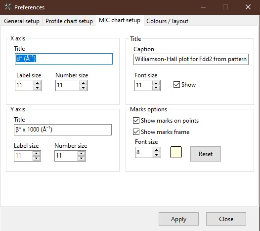

.. GetControl documentation - Preferences form

.. _Preferences:

Preferences
###########

**Preferences** allows you to preset some important settings or adjust the layout of the :ref:`Main Form<Main Form>` and the application itself. It has four tabs that group the properties together for better organisation.

.. _General setup:

General setup tab
=================

.. figure:: ./img/pref-general.jpg
    :width: 50%
    :align: center

    Preferences: General setup tab

Checkboxes
-----------

The top part contains the selection of behaviours, which are detailed below.

- Save windows' position and size
    If checked, it will store the size and position of each window in the application and store it in the file in :ref:`config<SettingStorage>` folder. It also applies to the position of the splitter between *Files list* and *Information pages*.

    * By default, it is **True**.
- Save program setting
    It saves the setting in the file in the :ref:`config<SettingStorage>` folder. If *False*, nothing is stored, not even application paths.

    * By default, it is **True**.
- Apply Scor factor to errors
    It multiplies all errors by the *Scor* factor (see :ref:`Refinement summary<Refinement summary>` tab).

    * By default, it is **False**.
- Automatic check for updates
    If *True*, the application checks at the launch for the new versions on the GitHub server. A small file (around 50 kB) is downloaded during that process. If a new version is found, the user is informed.

    * By default, it is **True**
- Ask for name when backup?
    If *True*, the ``Backup structure`` (see :ref:`Menu and Toolbar<Menu and Toolbar>` -> ``Edit``) function asks for the new name instead of putting automatically **-backup** string.

    * By default, it is **False**

.. tip::
    Even if it is *False* by default, it is very useful to check ``True`` the **Ask for a name when backup?** options. It combines the *Backup* and *Rename* functions into one.

If the ``Write debug log`` menu (see :ref:`Menu and Toolbar<Menu and Toolbar>` -> ``Help``) is checked, the log files are created and stored in the :ref:`config<SettingStorage>` folder. The size and number of LOG files are shown. You can open the directory to see the files, or you can clean up all the log files when their size becomes too big.

Application paths
-----------------

In the four edits, you should provide the paths to the used application as *FullProf*, *CIF viewer*, *Dysnomia* and external *text editor* of your choice.

The *labels* above the edits link to the proposed **web pages** to download the necessary applications.

You can navigate to the appropriate path by clicking the *Directory* icon on the left side of each edit.

Bottom part
-----------

**Length of error** (default **1**, interval **1-3**)
    It sets the maximum size of the errors behind the value (ex. 12.548(454) for length=3).

**Save Bragg positions**
    It sets the weather how the Bragg positions are saved in the SXY files (see :ref:`Menu and Toolbar<Menu and Toolbar>` -> ``Export``). It has two options:

    - all phases in one XY (default)
        This is the default option and saves all the Bragg in one column independent of the phase count. It is stored in the PRF file the same way. The file is smaller.
    - XY for each phase
        It splits the Braggs for each phase and stores the columns for each phase.

.. tip::
    To be able to use the **SXY plotter** script with the phase contributions (as :ref:`here<SXY plotter example>`), one has to switch to **XY for each phase**.

.. _Profile chart:

Profile chart setup
===================

.. figure:: ./img/pref-line.jpg
    :width: 50%
    :align: center

    Preferences: Profile chart setup tab

Here you can set the properties of the :ref:`Profile viewer<Profile viewer>` chart as *label/number font size* of the axis, axis *titles*, *legend font size* and *visibility*, etc. The description of the setting is quite intuitive, so there is no more explanation here.

.. important::
    The *font size* will be preserved, but titles will be changed/reloaded when the new PCR is selected.

.. _MIC chart:

MIC chart setup
===============

    Preferences: MIC chart setup tab

Here, you can set the properties of the :ref:`Microstructure viewer <Microstructure viewer>` chart as *label/number font size* of the axis, axis *titles*, *marks* options, etc. The description of the setting is quite intuitive, so there is no more explanation here.

.. important::
    The *font size* and *marks* settings will be preserved, but titles will be changed/reloaded when the new PCR is selected.

.. _Colours and layout:

Colours/layout
==============

Here, you can adjust the colours for the phases if you are not happy with the primary selection.

The size of the icons on the :ref:`Main form<Main form>` can be adjusted if necessary together with the font size of the *hints* in :ref:`Editor<Editor>`. This is practical for HiDPI monitors where *hints* take too much of the screen space.

.. figure:: ./img/pref-layout.jpg
    :width: 50%
    :align: center

    Preferences: Colours/layout tab
