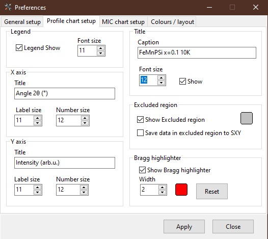
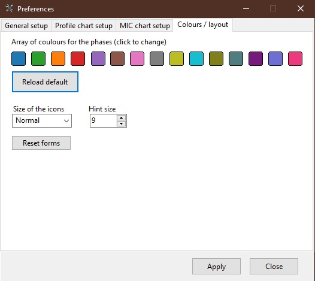

.. GetControl documentation - Preferences form

.. _Preferences:

Preferences
###########

**Preferences** allows the preset some important setting or adjust the layout of the :ref:`Main Form<Main Form>`. It has four tabs which group together the properties for better organisation.

General setup tab
-----------------

.. figure:: ./img/pref-general.jpg
    :width: 80%
    :align: center

    Preferences: General setup tab

Profile chart setup
-------------------

    Preferences: Profile chart setup tab

MIC chart setup
---------------

.. figure:: ./img/pref-mic.jpg
    :width: 80%
    :align: center

    Preferences: MIC chart setup tab

Colours/layout
--------------

    Preferences: Colours/layout tab
