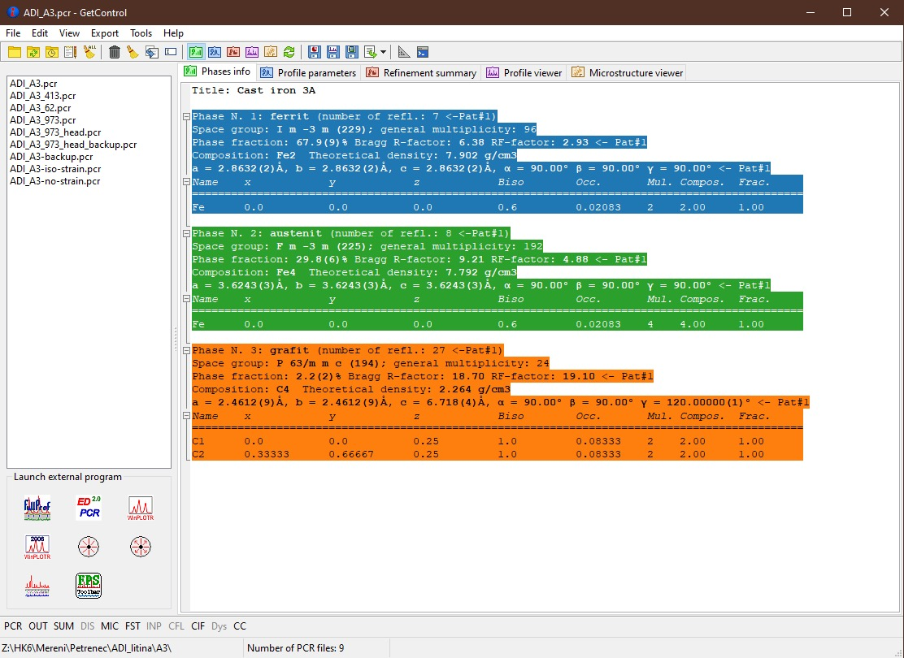

.. GetControl documentation main page

.. Links:
.. _FullProf Suite: https://www.ill.eu/sites/fullprof/

GetControl
##########

**GetControl** software is designed to help with managing structural refinements (mainly using the powder diffraction data) performed using `FullProf Suite`_ software.

It can help to visualise all PCR files in the directory, collect and aggregate the information from various files created during the structural refinement and visualise them. Furthermore, it facilitates easy access to the supplementary files with further analysis.

I developed it to help me get a quicker overview and control over a vast number of additional info you can obtain from the refinement. Of course, the way it works is not suitable for all, but someone can find it helpful.

    The main window of GetControl

The tool is under continuous but unregular development. All bug reports or suggestions are welcomed (see :ref:`Contact<Contact>`).

Download
--------

The application 32- and 64-bit executables for **Windows**, **Linux** or 64-bit image disk (DMG) for **macOS** can be downloaded :ref:`here<Download>`.

Table of content
----------------

.. toctree::
   :caption: Documentation
   :maxdepth: 1
   :glob:

   ./documentation/introduction
   ./documentation/mainform
   ./documentation/preferences
   ./documentation/editor
   ./documentation/plotters
   ./documentation/changelog

.. toctree::
    :caption: FullProf Tricks
    :maxdepth: 1
    :glob:

    ./fptricks/*
